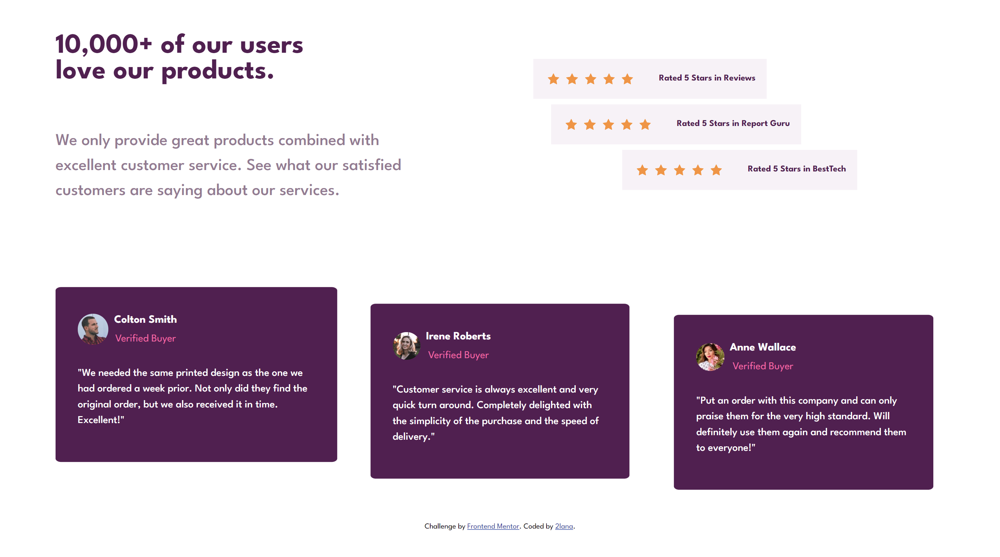

# Frontend Mentor - Social proof section solution

This is a solution to the [Social proof section challenge on Frontend Mentor](https://www.frontendmentor.io/challenges/social-proof-section-6e0qTv_bA). Frontend Mentor challenges help me improve my coding skills by building realistic projects.

## Table of contents

- [Overview](#overview)
  - [The challenge](#the-challenge)
  - [Screenshot](#screenshot)
  - [Links](#links)
- [My process](#my-process)
  - [Built with](#built-with)
  - [What I learned](#what-i-learned)
  - [Continued development](#continued-development)
  - [Useful resources](#useful-resources)
- [Author](#author)
- [Acknowledgments](#acknowledgments)

## Overview

### The challenge

Users should be able to:

- View the optimal layout for the section depending on their device's screen size

### Screenshot




### Links

- Solution URL: [Github](https://github.com/2lana/social-proof-section-master)
- Live Site URL: [Netlify](https://peppy-snickerdoodle-2e2160.netlify.app/)

## My process

### Built with

- Semantic HTML5 markup
- CSS custom properties
- Flexbox
- CSS Grid
- Mobile-first workflow
- [Styled Components](https://styled-components.com/) - For styles

### What I learned

My major learnings while working through this project.

See below:

```html
<div class="verified-buyer-smith">
  
  <div class="buyer-info">
    <h2 class="name-buyer">Colton Smith</h2>
    <div class="status-buyer">Verified Buyer</div>
  </div>
  <p class="description-buyer">
    "We needed the same printed design as the one we had ordered a week prior.
    Not only did they find the original order, but we also received it in time.
    Excellent!"
  </p>
</div>
```

```css
.buyers {
  display: grid;
  grid-template-columns: 1fr 1fr 1fr;
  padding: 0 3rem 1rem 3rem;
  gap: 2rem;
}
```

### Continued development

I want to continue focusing on in future projects. These could be concepts still not completely comfortable with or techniques found useful that want to refine and perfect.

### Useful resources

[frontendmentor](https://www.frontendmentor.io/) - This resource gives me the opportunities to learn more about the use frontend and real practice code simple challenges for beginners. Respect!

- [jqueryvalidation](https://jqueryvalidation.org/validate/) - This jQuery plugin makes simple clientside form validation easy.
- [freecodecamp](https://www.freecodecamp.org/) - This recource helped me learn to code
- [developer.mozilla](https://developer.mozilla.org) - This helped me as resourses for developers by developers.
- [w3schools](https://www.w3schools.com/) - This is an amazing resource which helped me better understand html, css. I'd recommend it to anyone still learning technical concept.
- [screen resolution simulator](https://searchenginereports.net/screen-resolution-simulator) - This is an amazing resource which helped me.
- [Chrome DevTools](https://developer.chrome.com/docs/devtools/console/) - This recource help me testing html and css.
- [W3C](https://validator.w3.org/) - This recource help me checks the markup validity of Web documents in HTML and CSS.
- [docs.github](https://docs.github.com/en/get-started) - This recource helped me try to understand githab for the first time in my life. I created three repositories, two folders and deleted them several times, it’s a nightmare.

Most YouTube channels represent the author’s personal point of view. Only documentation should be examined.

## Author

- Frontend Mentor - [@2lana](https://www.frontendmentor.io/profile/2lana)

## Acknowledgments

Only practice

Grateful for reading and reply to every constructive comment.
